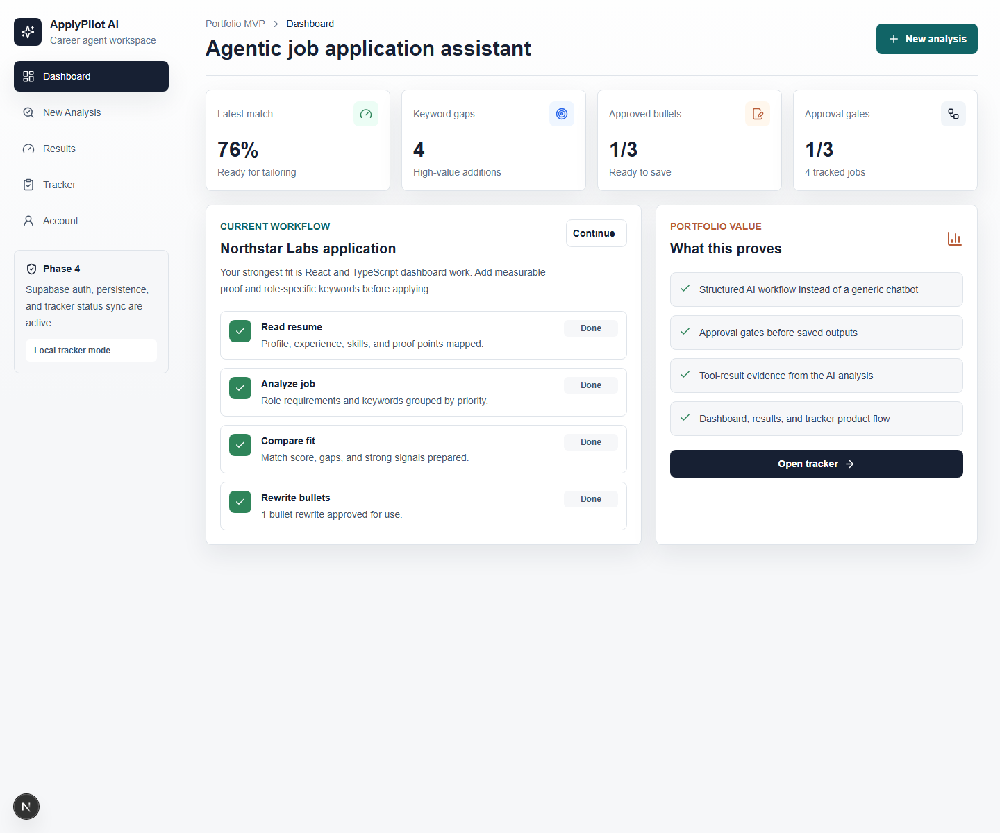
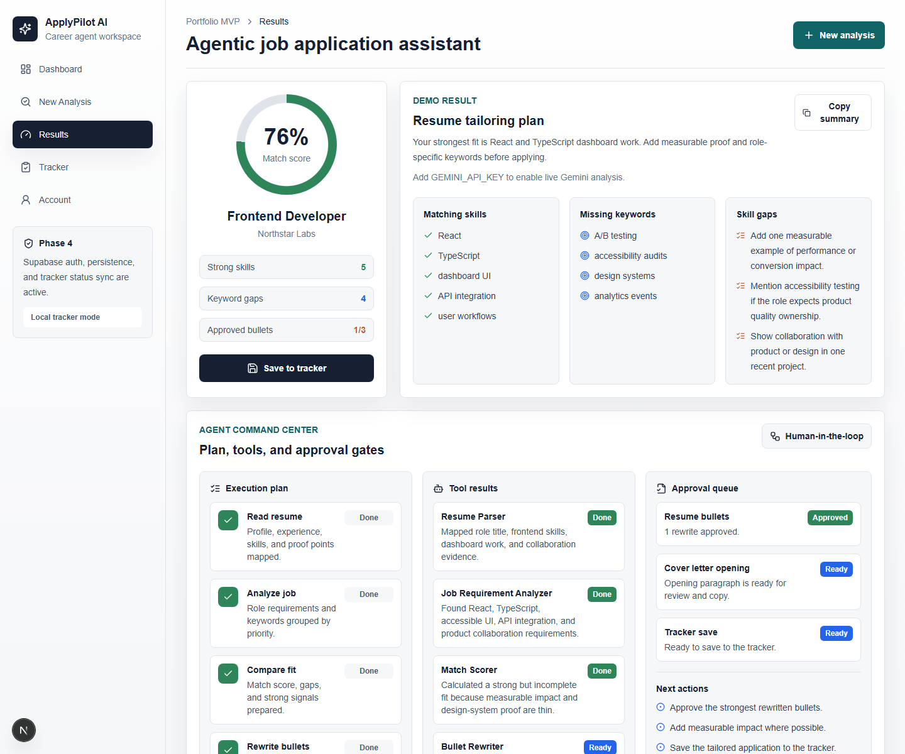
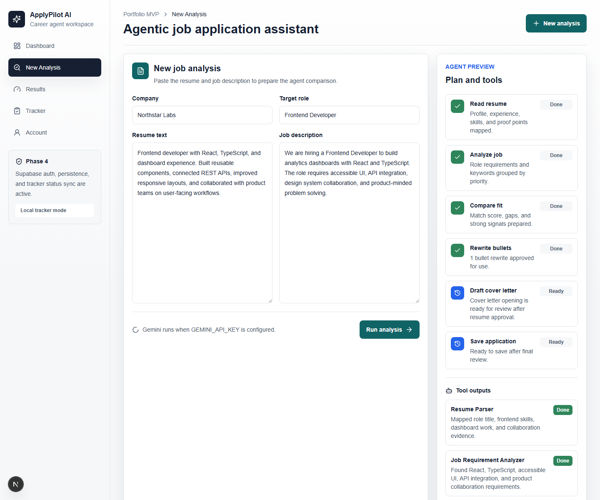
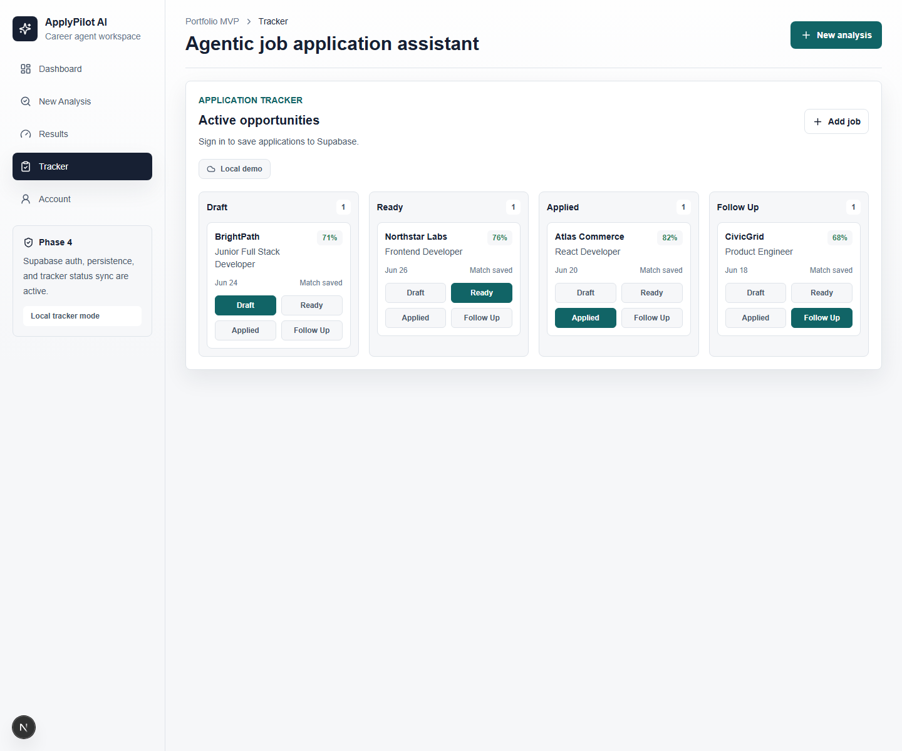

# ApplyPilot AI

ApplyPilot AI is an agentic job application assistant that helps job seekers compare a resume against a target job, identify fit gaps, approve AI-generated resume improvements, draft a tailored cover letter opening, and track applications.

Live app: https://applypilot-ai-murex.vercel.app

## Screenshots

| Dashboard | Agent Results |
| --- | --- |
|  |  |

| New Analysis | Application Tracker |
| --- | --- |
|  |  |

## Problem

Job seekers often use AI tools as generic chatbots, which produces feedback that is hard to trust, compare, or reuse. ApplyPilot AI turns that process into a structured workflow: analyze the resume, inspect the job description, score the fit, rewrite weak bullets, require human approval, and save the application state.

## Core Features

- Resume and job description analysis
- Gemini-powered match score and structured feedback
- Keyword and skill gap detection
- Resume bullet rewrite suggestions
- Human approval gates before saving generated content
- Agent command center with plan, tool outputs, approval queue, and next actions
- Cover letter opening draft
- Application tracker with editable statuses
- Supabase auth and row-level-secured persistence
- Demo fallback when AI or Supabase configuration is unavailable

## Architecture

```mermaid
flowchart LR
  User[User] --> UI[Next.js App Router UI]
  UI --> Analyze[/api/analyze]
  Analyze --> Gemini[Gemini API]
  UI --> Supabase[Supabase Auth + Postgres]
  Supabase --> RLS[Row Level Security]
  UI --> Tracker[Application Tracker]
  Analyze --> Results[Structured Analysis JSON]
  Results --> Agent[Agent Command Center]
```

## AI Workflow

The AI route asks Gemini for strict structured output rather than free-form chat text. The UI then renders that output into product surfaces:

- `matchScore`
- `matchingSkills`
- `missingKeywords`
- `skillGaps`
- `bulletSuggestions`
- `coverLetterOpening`
- `agentSteps`
- `toolRuns`
- `approvalGates`
- `nextActions`

If the model request fails or the API key is missing, the app returns a demo analysis with the same data shape, so the product remains usable and testable.

## Security Notes

- Gemini key is used only in the server route.
- Supabase browser key is public by design; service-role keys are not used.
- Supabase persistence uses row-level security.
- `.env.local` is ignored by git.
- Smoke tests check that the Gemini key is not exposed in page HTML.

## Tech Stack

- Next.js
- React
- TypeScript
- Tailwind CSS
- Gemini API
- Supabase Auth + Postgres
- Vercel
- GitHub

## Local Development

```bash
npm install
npm run dev
```

Open `http://localhost:3000`.

Run checks:

```bash
npm run type-check
npm run test:supabase
npm run test:smoke
```

## Environment Variables

Create `.env.local`:

```bash
GEMINI_API_KEY=your_key_here
GEMINI_MODEL=gemini-2.5-flash
NEXT_PUBLIC_SUPABASE_URL=your_project_url
NEXT_PUBLIC_SUPABASE_ANON_KEY=your_anon_or_publishable_key
```

Supabase may label the browser key as a publishable key. Do not add a service-role key to this app.

## Supabase Setup

1. Create a Supabase project.
2. Open the Supabase SQL editor.
3. Run `supabase/schema.sql`.
4. Add the Supabase URL and anon/publishable key to `.env.local`.
5. Restart the Next.js server.

## Verification

The deployed app currently passes:

- TypeScript check
- production build
- dependency audit
- Supabase table reachability test
- live Vercel smoke test

## Roadmap

- Full saved analysis history per user
- Resume PDF parsing
- Cover letter export
- Status activity log
- Demo video for portfolio presentation
